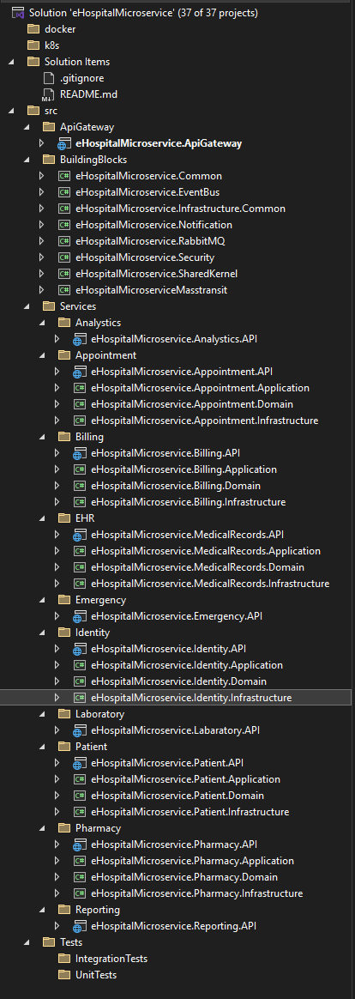

# 🏥 eHospital Microservices



## 📋 Overview

**eHospital** is a comprehensive healthcare management system built with microservices architecture, implementing Domain-Driven Design (DDD) and Clean Architecture principles. This project demonstrates modern software architecture patterns and best practices for building scalable, maintainable enterprise applications.

## 🎯 Architecture Highlights

- **Microservices Architecture** with independent, scalable services
- **Clean Architecture** + **Domain-Driven Design (DDD)**
- **CQRS Pattern** with MediatR
- **Event-Driven Architecture** using MassTransit & RabbitMQ
- **API Gateway** with YARP (Yet Another Reverse Proxy)
- **Distributed Caching** with Redis
- **Identity Management** with Keycloak
- **Container-Ready** with Docker & Kubernetes support

## 🚀 Technology Stack

### Core Technologies
- **.NET 9** - Latest framework for high-performance applications
- **Minimal APIs** - Lightweight, fast HTTP APIs
- **Entity Framework Core 8** - Modern ORM for data access
- **PostgreSQL** - Primary database
- **MongoDB** - Document storage for flexible data
- **Redis** - Distributed caching and session management

### Messaging & Events
- **MassTransit** - Distributed application framework
- **RabbitMQ** - Message broker for async communication
- **SignalR** - Real-time web functionality

### Identity & Security
- **Keycloak** - Open source identity and access management
- **JWT Bearer** - Token-based authentication
- **OAuth 2.0 / OpenID Connect** - Industry standard protocols

### Observability
- **Serilog** - Structured logging
- **OpenTelemetry** - Distributed tracing
- **Health Checks** - Service health monitoring
- **Seq** - Log aggregation and analysis

## 📦 Microservices

| Service | Description | Technologies | Status |
|---------|-------------|--------------|--------|
| **API Gateway** | Central entry point, routing, load balancing | YARP, Rate Limiting | 🟡 In Progress |
| **Identity Service** | Authentication, authorization, user management | Keycloak, JWT | 🟡 In Progress |
| **Patient Service** | Patient registration and management | PostgreSQL, Redis, DDD | 🟡 In Progress |
| **Appointment Service** | Appointment scheduling and management | MongoDB, SignalR | 🔴 Planned |
| **Medical Records (EHR)** | Electronic health records management | PostgreSQL, MinIO | 🔴 Planned |
| **Laboratory Service** | Lab test ordering and results | PostgreSQL, RabbitMQ | 🔴 Planned |
| **Pharmacy Service** | Medication and prescription management | SQL Server, MassTransit | 🔴 Planned |
| **Billing Service** | Financial operations and insurance | SQL Server, Hangfire | 🔴 Planned |
| **Emergency Service** | Emergency case management | Redis, SignalR | 🔴 Planned |
| **Notification Service** | Multi-channel notifications | SendGrid, Twilio | 🔴 Planned |
| **Reporting Service** | Analytics and reporting | MongoDB, Elasticsearch | 🔴 Planned |

## 🏗️ Project Structure

```
eHospital/
├── src/
│   ├── ApiGateway/
│   │   └── eHospitalMicroservice.ApiGateway/
│   ├── BuildingBlocks/
│   │   ├── eHospitalMicroservice.Common/
│   │   ├── eHospitalMicroservice.EventBus/
│   │   ├── eHospitalMicroservice.Infrastructure.Common/
│   │   ├── eHospitalMicroservice.MassTransit/
│   │   ├── eHospitalMicroservice.Notification/
│   │   ├── eHospitalMicroservice.RabbitMQ/
│   │   ├── eHospitalMicroservice.Security/
│   │   └── eHospitalMicroservice.SharedKernel/
│   └── Services/
│       ├── Analytics/
│       ├── Appointment/
│       ├── Billing/
│       ├── EHR/
│       ├── Emergency/
│       ├── Identity/
│       ├── Laboratory/
│       ├── Patient/
│       ├── Pharmacy/
│       └── Reporting/
├── tests/
│   ├── IntegrationTests/
│   └── UnitTests/
├── docker/
├── k8s/
└── docs/
```

## 🔧 Getting Started

### Prerequisites

- .NET 8 SDK
- Docker Desktop
- PostgreSQL
- MongoDB
- Redis
- RabbitMQ
- Keycloak

### Quick Start

1. **Clone the repository**
```bash
git clone https://github.com/yourusername/eHospitalMicroservice.git
cd eHospitalMicroservice
```

2. **Start infrastructure services**
```bash
docker-compose -f docker/docker-compose.infrastructure.yml up -d
```

3. **Setup Keycloak**
```bash
# Start Keycloak
docker-compose -f docker/docker-compose.keycloak.yml up -d

# Access Keycloak Admin Console
# URL: http://localhost:8080
# Username: admin
# Password: admin
```

4. **Run database migrations**
```bash
# Patient Service
dotnet ef database update -p src/Services/Patient/eHospitalMicroservice.Patient.Infrastructure

# Other services...
```

5. **Start the services**
```bash
# API Gateway
dotnet run --project src/ApiGateway/eHospitalMicroservice.ApiGateway

# Identity Service
dotnet run --project src/Services/Identity/eHospitalMicroservice.Identity.API

# Patient Service
dotnet run --project src/Services/Patient/eHospitalMicroservice.Patient.API
```

6. **Access the application**
- API Gateway: https://localhost:5000
- Swagger UI: https://localhost:5000/swagger
- Keycloak: http://localhost:8080

## 🧪 Testing

### Unit Tests
```bash
dotnet test tests/UnitTests
```

### Integration Tests
```bash
dotnet test tests/IntegrationTests
```

## 🐳 Docker Support

### Build images
```bash
docker-compose build
```

### Run with Docker Compose
```bash
docker-compose up
```

## ☸️ Kubernetes Deployment

### Deploy to Kubernetes
```bash
kubectl apply -f k8s/
```

### Check deployment status
```bash
kubectl get pods -n ehospital
kubectl get services -n ehospital
```

## 📚 Documentation

- [Architecture Overview](./docs/architecture.md)
- [API Documentation](./docs/api.md)
- [Development Guide](./docs/development.md)
- [Deployment Guide](./docs/deployment.md)

## 🤝 Contributing

Contributions are welcome! Please feel free to submit a Pull Request.

1. Fork the project
2. Create your feature branch (`git checkout -b feature/AmazingFeature`)
3. Commit your changes (`git commit -m 'Add some AmazingFeature'`)
4. Push to the branch (`git push origin feature/AmazingFeature`)
5. Open a Pull Request

## 📄 License

This project is licensed under the MIT License - see the [LICENSE](LICENSE) file for details.

## 👨‍💻 Author

**Nuri Yılmaz**
- GitHub: [@turkmvc](https://github.com/turkmvc)

## 🙏 Acknowledgments

- Built with modern .NET technologies
- Inspired by microservices best practices
- Domain-Driven Design principles by Eric Evans
- Clean Architecture principles by Robert C. Martin

## 📞 Contact

For questions and support, please open an issue in the GitHub repository.

---

<div align="center">
  <strong>🏥 Building the future of healthcare management systems</strong>
</div>
